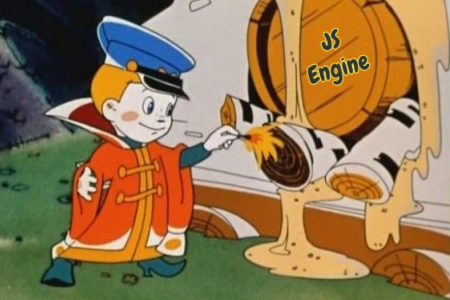

# Unexpected Challenged JavaScript
This is a compilation of weird and bizzare JavaScript challenges.

Contains different problems which require understanding of the nature of JavaScript language and sometimes thinking outside the box. Please **do not use** this at technical interviews, because it has a good chance to break a fine candidate. This is absolutly useless stuff in real life of your JavaScript applications and exists just for fun and trolling.

## Problems
[The Shortest Memoization](problems/1.md/#the-shortest-memoization)  
[Braces Obfuscation](problems/2.md/#braces-obfuscation)  
[Snowing day](problems/3.md/#snowing-day)  
[Countdown Expression](problems/4.md/#countdown-expression)  
[Done by Ones](problems/5.md/#done-by-ones)  
[Broken Pipe](problems/6.md#broken-pipe)  
[Look Complex](problems/7.md#look-complex)  
[Find X](problems/8.md#find-x)  