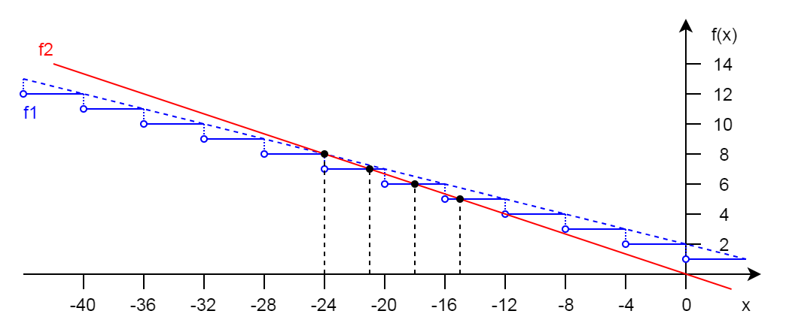
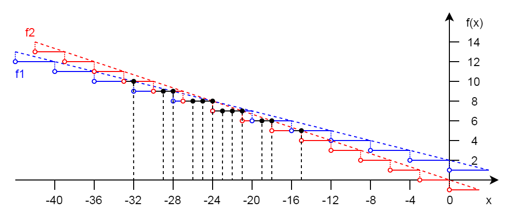

# Find X
The **first** equation:

```javascript
9 +~ x >> 6 / 3 = -x / 3
```
To solve lets find an approximate mathematical analogue of the equation:

```javascript
9 +~ x >> 6 / 3 = -x / 3
(9 +~ x) >> (6 / 3) = -x / 3
(8 - x) div 4 = -x / 3
(8 - x) / 4 = -x / 3
```
So we have a simple linear equation. And the obvious solution is *x* = -24. 

But we have some [bitwise operators](https://developer.mozilla.org/en-US/docs/Web/JavaScript/Reference/Operators/Bitwise_Operators) (Bitwise NOT and Sign-propagating right shift). To see its impact take a look at the graphics of the functions of the left (f1) and right (f2) sub-expressions:



It has four solutions: *x* = [-24, -21, -18, -15].

The **second** equation:

```javascript
9 +~ x >> 6 / 3 = -x / 3 | 0
```
It has a difference: Bitwise OR in the right sub-expression. We might to fix up the graphic:



So there are 12 solutions: x = [-32, -29, -28, -26, -25, -24, -23, -22, -21, -19, -18, -15].

But there is a "bitwise" trap in that equation. Because bitwise operators convert number to signed 32-bit integers and drop excess bits if a number is out of scope. For the instance, *x* = 12884901864 is a solution too. Just try:

```javascript
9 +~ 12884901864 >> 6 / 3 = -12884901864 / 3 | 0
9 +~ 12884901864 >> 2 = -4294967288 | 0
9 + 23 >> 2 = 8
8 = 8 
```
So it has much more solution out of 32-bit integers.

[Paper here (ru)](https://habr.com/ru/company/semrush/blog/475594/)  
